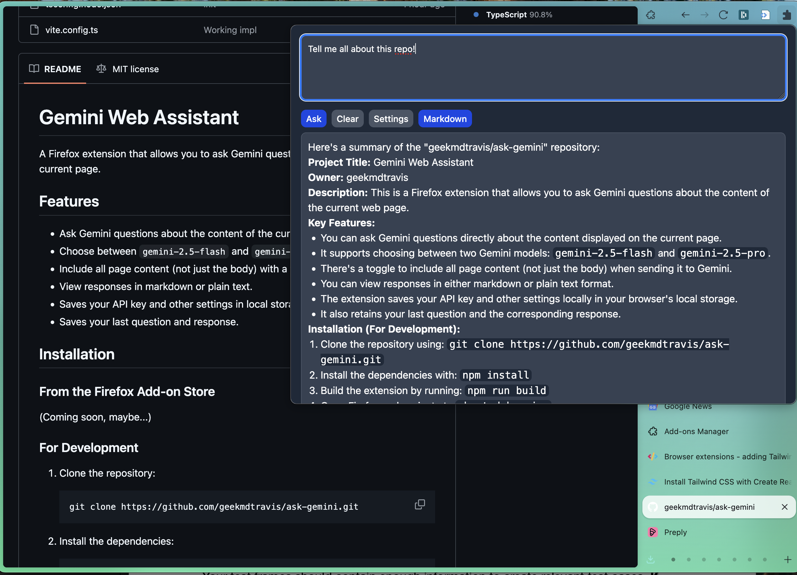

# Gemini Web Assistant

A Firefox extension that allows you to ask Gemini questions about the content of the current page.

## Features

*   Ask Gemini questions about the content of the current page.
*   Choose between `gemini-2.5-flash` and `gemini-2.5-pro` models.
*   Include all page content (not just the body) with a toggle.
*   View responses in markdown or plain text.
*   Saves your API key and other settings in local storage.
*   Saves your last question and response.

## Installation

### From the Firefox Add-on Store

(Coming soon, maybe...)

### For Development

1.  Clone the repository:

    ```bash
    git clone https://github.com/geekmdtravis/ask-gemini.git
    ```

2.  Install the dependencies:

    ```bash
    npm install
    ```

3.  Build the extension:

    ```bash
    npm run build
    ```

4.  Open Firefox and go to `about:debugging`.
5.  Click on "This Firefox" and then "Load Temporary Add-on".
6.  Select the `dist` directory in the project folder.
7.  Select the "manifest.json" file.

## Usage

1. Activate the extension: (a) Click on the extension icon in the Firefox toolbar. (b) Press `Ctrl+Shift+G`.
2.  Enter your Gemini API key in the settings.
3.  Enter a question in the text area and click "Ask".
4.  The response will be displayed below the text area.



## Contributing

Contributions are welcome! Please follow these steps to contribute:

1.  Fork the repository.
2.  Create a new branch:

    ```bash
    git checkout -b my-new-feature
    ```

3.  Make your changes and commit them:

    ```bash
    git commit -am 'Add some feature'
    ```

4.  Push to the branch:

    ```bash
    git push origin my-new-feature
    ```

5.  Create a new pull request.

## License

This project is licensed under the MIT License. See the [LICENSE](LICENSE) file for details.
